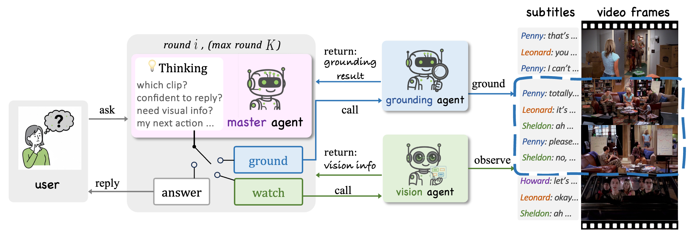

# 🎬LongVideoAgent: 长视频多智能体推理

## 📝 摘要
多模态大语言模型（MLLM）和基于工具的长视频问答系统的最新进展展示了对长达一小时视频进行推理的前景。然而，许多方法仍将内容压缩为有损摘要或依赖有限的工具集，削弱了时间定位并丢失了细粒度线索。我们提出了 **LongVideoAgent**，这是一个多智能体框架，其中 Master LLM 协调 Grounding Agent 定位与问题相关的片段，并协调 Vision Agent 提取针对性的视觉观测。Master Agent 以步数限制进行规划，并通过强化学习（GRPO）进行训练，以鼓励简洁、正确且高效的多智能体协作。这种设计通过定位帮助 Master Agent 专注于相关剪辑，用视觉细节补充字幕，并产生可解释的轨迹。在我们提出的 LongTVQA 和 LongTVQA+（从 TVQA/TVQA+ 聚合而成的剧集级数据集）上，我们的多智能体系统显著优于强大的非智能体基线。实验还表明，强化学习进一步加强了训练后智能体的推理和规划能力。

---

## 🌟 概览
传统的单次处理 MLLM 在一个上下文中摄取整个长视频，通常（可能通过大量的下采样和压缩）经常会丢失关键证据并产生错误的答案，而 **LongVideoAgent** 进行*多智能体*、*多轮*和*多模态*推理，以提取稀疏的、与任务相关的线索并正确回答。

<p align="center">
  
</p>

---

## 🤖 方法：多智能体框架


**LongVideoAgent** 的架构。**MasterAgent** 运行最多 $K$ 轮，与 **GroundingAgent** 协作从视频中定位相关剪辑，并与 **VisionAgent** 协作从定位的帧中读取细粒度线索。证据不断累积，直到 **MasterAgent** 有信心回答用户的问题。

### 🔄 迭代推理循环
与单次处理模型不同，LongVideoAgent 在有界循环（最多 $K$ 步）中运行。在每一步中，**MasterAgent** 生成“思考”轨迹并发出结构化动作标记：
- `<request_grounding>`：调用 **GroundingAgent** 根据字幕定位相关的视频片段。智能体返回一个符号标签 `<clip_X>`。
- `<visual_query>`：调用 **VisionAgent** 从定位的剪辑中提取特定的视觉细节（物体、动作、文本）。智能体返回文本观测结果。
- `<answer>`：当收集到足够的证据时，终止循环并提供最终回答。

### 🧠 强化学习 (GRPO)
我们使用组相对策略优化（Group Relative Policy Optimization, GRPO）来优化 MasterAgent。训练目标包括：1. 结构有效性。2. 回答正确性：奖励智能体得出正确的最终答案。

---

## 📈 实验结果
我们在剧集级数据集 **LongTVQA** 和 **LongTVQA+** 上评估了 LongVideoAgent。

### 主要结果
在 *LongTVQA* 和 *LongTVQA+* 上的表现。左侧块列出了模型属性（*Agentic*、*Input*、*RL fine-tune*）；右侧块报告了验证准确率 (%)。GPT-4o 和 Gemini-2.5 Pro 是直接处理并接受完整长视频的*多模态*基线。标记为 `Agentic` 的方法表示模型作为 MasterAgent 运行；标记为 `AgenticRL` 的方法还表示进行了 RL 微调。括号中的绿色数字表示相对于紧接的前一个（非智能体或非 RL）设置的绝对增益。我们观察到：(i) 我们的多智能体框架 **LongVideoAgent** 一致优于非智能体对应模型；(ii) 智能体 RL 带来了额外的增益，特别是对于较小的开源模型；(iii) 使用视频帧提供了字幕之外的视觉证据，并且通常优于仅字幕输入；(iv) 闭源模型仍然强大，但当开源模型采用智能体设计和智能体 RL 时，差距大大缩小。

<p align="center">
  
</p>

### 🔍 消融实验分析
我们进行了全面的消融研究以验证我们的设计选择。首先，我们观察到定位和视觉智能体都是必不可少的，完整的多智能体系统达到了最高的准确率。其次，增加推理步数限制 $K$ 可以提高性能直到饱和，证实了迭代规划的价值。最后，更强大的视觉骨干网络和更大的时间窗口提供了更丰富的上下文，进一步提升了智能体的推理能力。

<p align="center">
  
</p>

---

## 📝 引用
如果您觉得我们的工作有帮助，请引用：
```bibtex
@misc{liu2025longvideoagentmultiagentreasoninglong,
      title={LongVideoAgent: Multi-Agent Reasoning with Long Videos}, 
      author={Runtao Liu and Ziyi Liu and Jiaqi Tang and Yue Ma and Renjie Pi and Jipeng Zhang and Qifeng Chen},
      year={2025},
      eprint={2512.20618},
      archivePrefix={arXiv},
      primaryClass={cs.AI},
      url={https://arxiv.org/abs/2512.20618}, 
}
```

---
